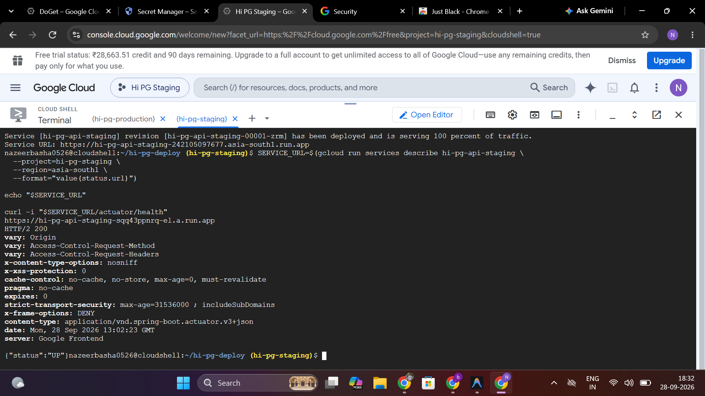

# Hi PG: Working, Technology Stack, and Deployment Guide

> Source of truth for the current repository as of 28 September 2026.
>
> This document explains the product, roles, end-to-end business flows, implemented technology stack, data and security design, current deployment, recommended production architecture, operations, and release process. It intentionally contains no passwords, API secrets, private keys, or admin credentials.

## 1. Executive summary

Hi PG is a paying-guest discovery and property-management platform with three controlled experiences:

- **Customer:** discovers nearby PGs, checks real-time bed availability, completes a profile, books a monthly or day-wise stay, pays online or directly to the owner, manages fees, raises PG complaints, and contacts platform support.
- **PG owner:** creates properties, floors/blocks, rooms and beds, configures pricing and availability, manages customers, verifies direct payments, handles complaints and move-outs, tracks fees, deposits, expenses and reports, and submits KYC for admin review.
- **Platform admin:** reviews owner/PG KYC, handles customer and owner support tickets, supervises platform operations, and performs privileged actions through server-authorized admin APIs.

The current repository is a monorepo:

| Layer | Current implementation |
|---|---|
| Mobile application | Flutter/Dart, Android-first, one app with role-gated customer and owner flows |
| Backend API | Java 17, Spring Boot 3.2.5 modular monolith |
| Database | PostgreSQL with Flyway migrations |
| Private documents | Cloudflare R2 through the S3-compatible API |
| Web | Next.js 16, React 18, TypeScript and Tailwind; public web/scaffolding, not yet full mobile parity |
| Current backend hosting | Render Blueprint: Docker web service and managed PostgreSQL |
| Current payments | Razorpay integration plus direct-owner UPI verification flow |
| Maps and identity | Google Maps, device location and Google Sign-In |

### Recommended deployment decision

Use the following arrangement for a professional production launch:

| Concern | Recommended service |
|---|---|
| Android distribution | Google Play Console, with Internal Testing before production |
| API container | Google Cloud Run in `asia-south1` |
| Container registry | Google Artifact Registry |
| Relational database | Cloud SQL for PostgreSQL 16 in the same region |
| Secrets | Google Secret Manager |
| KYC/customer documents | Keep the existing private Cloudflare R2 bucket initially |
| Push notifications | Firebase Cloud Messaging (FCM) |
| Phone authentication | Either Firebase Phone Authentication with backend token verification, or an Indian SMS provider behind the current OTP gateway |
| Maps and Google login | Google Maps Platform and Google Identity/OAuth |
| Payment gateway | Razorpay |
| Web application | Vercel for the Next.js app, or Cloud Run if one-cloud ownership is required |
| Monitoring | Cloud Logging, Cloud Monitoring, uptime checks and alerts |
| CI/CD | GitHub Actions or Cloud Build -> Artifact Registry -> Cloud Run |

The existing Render deployment is suitable for development and a controlled pilot. Do not treat a free Render database as the final production database for real customer, KYC, booking or payment data.

## 2. Product scope and terminology

### 2.1 User roles

#### Customer

The UI calls this role **Customer**. Some backend packages and the stored role still use the historic term `STUDENT`; this remains for API/database compatibility and does not change what the customer sees.

The customer can:

- sign in through phone OTP or Google;
- browse PGs and availability;
- choose current location or a manually searched location;
- filter by Men, Women, Co-Living and stay type;
- view property photos, address, map, directions, facilities, floors, rooms, beds and prices;
- complete and later edit the required profile;
- upload either Aadhaar or passport proof for applicable stays;
- select a specific bed and monthly or day-wise dates;
- pay online through Razorpay or directly to the owner where enabled;
- view bookings, rent, deposit, pending balance and receipts;
- submit move-out notice or cancel where business rules allow;
- raise a PG complaint to the owner;
- raise a separate platform support request to the admin.

#### PG owner

The owner can:

- sign up and sign in using the owner authentication flow;
- create and manage one or more PG properties;
- add a PG photo, verified city/address, map position, stay audience and contact details;
- create floors or blocks, rooms and generated beds;
- define a room as monthly, day-wise, or supporting both modes;
- set monthly and day-wise pricing;
- view the room calendar, availability and occupant information;
- call a customer when a valid contact number is available;
- view active, moved-out and unallocated customers;
- verify or reject direct-owner payment requests;
- track fees, payments, deposits, receipts, expenses and reports;
- handle customer PG complaints and move-out notices;
- submit owner/PG KYC documents for admin review;
- configure verified direct-payment details;
- submit platform support tickets to the admin.

Owners do not receive admin privileges. An admin screen must open only when the backend-issued access token contains the server-authorized admin role.

#### Platform admin

The admin can:

- view submitted owner and PG KYC records;
- open private KYC documents through short-lived signed URLs;
- approve or reject KYC with review notes;
- view platform support tickets raised by customers and owners;
- move tickets through Open, In progress and Resolved states;
- reply with a response that the requester can track;
- supervise platform-level operations and payment onboarding.

Admin passwords and account credentials must never be stored in this document, mobile source code, Git, screenshots, or client-side configuration.

### 2.2 Complaint versus platform support

These are separate workflows:

| Workflow | Raised by | Received by | Example |
|---|---|---|---|
| PG complaint | Customer staying at a PG | That PG's owner | Water issue, cleaning issue, electricity, room maintenance |
| Help & Support ticket | Customer or owner | Platform admin | Login issue, payment platform issue, KYC issue, account problem |

Keeping these paths separate prevents property owners from seeing platform/security issues and prevents admins from being used as the normal PG maintenance desk.

## 3. End-to-end working

### 3.1 Customer registration and session flow

1. The user opens the app and selects the customer path.
2. The user authenticates using phone OTP or Google Sign-In.
3. The backend validates the authentication assertion and creates or loads the local user.
4. The backend returns a short-lived JWT access token and a rotating refresh token.
5. The mobile app stores tokens in platform secure storage.
6. API calls include the bearer access token.
7. When the access token expires, the Dio client uses the refresh flow and retries the request.
8. After authentication, the customer lands on the customer home screen.

Security characteristics already present in the backend include a 15-minute access-token lifetime, a 30-day refresh-token lifetime, a five-minute OTP lifetime, OTP request controls and authentication rate limiting.

### 3.2 Discovery and location flow

1. On first use, the app asks for location permission with a clear explanation.
2. If allowed, device coordinates are obtained and sent only for discovery queries that need them.
3. If permission is denied, the app remains usable through manual city/area search.
4. A manually selected location is retained and changed only when the user taps the location selector.
5. The discovery API filters PGs using coordinates/city and availability rather than mixing unrelated cities.
6. The default home feed can show a general list only when no location has been selected.
7. Filters further restrict by audience and stay type.

For food-delivery-style nearby behavior, every published PG needs valid latitude and longitude. City text alone is not sufficient for accurate distance filtering.

### 3.3 Property, room and bed availability

The hierarchy is:

```text
Owner
  -> PG property
      -> Floor or block
          -> Room
              -> Bed
```

Each published property exposes only customer-safe data. Owner KYC, private contact data and internal records are not part of public discovery responses.

Rooms can support:

- monthly only;
- day-wise only;
- monthly and day-wise.

The customer selection controls which compatible floors, rooms and beds are shown. A day-wise customer should not be offered a monthly-only room. Availability is date-sensitive for day-wise stays.

### 3.4 Customer profile and identity document flow

The required booking profile is completed once and can later be edited:

1. Customer enters legal name, profession/occupation, contact phone and permanent address.
2. For a stay that requires identity proof, the customer selects **Aadhaar card** or **Passport**.
3. The customer uploads a JPG, PNG or PDF within the server's 10 MB limit.
4. The app sends multipart form data to the authenticated backend.
5. The backend validates type, size, user ownership and business requirements.
6. The file is stored in the private R2 bucket using a non-public object key.
7. PostgreSQL stores document metadata and object reference, not the binary file.
8. After successful save, the profile screen shows a clean summary and an Edit action instead of displaying the empty form again.
9. Authorized views request a short-lived signed URL when the document must be opened.

The application does not need the full Aadhaar number. Avoid collecting sensitive identifiers that are not required for the business purpose.

### 3.5 Booking and concurrency flow

1. Customer selects a compatible floor, room and exact bed.
2. For day-wise booking, the customer selects permitted dates from the availability calendar.
3. The API validates that the profile is complete and the bed is eligible for the selected stay type.
4. The backend opens a database transaction and locks the bed/booking resource.
5. Existing overlapping active bookings and holds are checked.
6. A temporary booking/payment state is created.
7. The customer selects a payment method.
8. The booking is confirmed only after the selected payment path succeeds.

The PostgreSQL transaction and pessimistic locking are important: two phones must not successfully reserve the same bed for overlapping dates.

For a day-wise bed occupied until tomorrow, today is unavailable and the first selectable date is the day after the existing stay ends, according to the stored checkout convention.

### 3.6 Online payment flow

1. Mobile requests a payment order from the backend.
2. Backend calculates the authoritative amount and creates the internal order.
3. Backend creates a Razorpay order when gateway credentials are configured.
4. Mobile opens the Razorpay checkout with the returned public order data.
5. Razorpay returns payment identifiers/signature to the app.
6. Mobile submits completion data to the backend.
7. Backend validates signatures and stored amount/state before confirming.
8. Webhook processing provides server-to-server reconciliation.
9. Duplicate callbacks are handled idempotently.
10. Booking and bed allocation become confirmed only after verified success.

Never accept a price sent by the mobile app as authoritative. Amounts must always be calculated and checked on the server.

### 3.7 Direct-owner payment flow

This path is intentionally an approval workflow because the money is transferred outside the platform gateway:

1. Owner completes the necessary KYC and configures beneficiary name, UPI ID and support mobile.
2. Owner enables direct payments for the PG.
3. Customer selects a bed and chooses **Pay directly to owner**.
4. App displays the owner-approved payment details.
5. Customer pays in an external UPI app.
6. Customer submits **I have paid / Inform owner** with the expected payment information.
7. The request appears in the owner's payment-verification queue.
8. Owner checks the actual bank/UPI receipt and either approves or rejects.
9. Approval confirms the existing customer-selected room and bed; the owner should not allocate another bed manually.
10. Rejection leaves the bed unconfirmed and records the reason/state.

This flow must not mark a bed as occupied merely because the customer tapped the payment button.

### 3.8 Owner inventory and pricing flow

1. Owner creates or edits a property with validated city/address and map coordinates.
2. Owner creates a floor/block using a name unique within that PG.
3. Owner creates a room with a name/number unique within that floor or applicable property boundary.
4. Owner selects capacity; the backend generates bed records.
5. Owner selects monthly/day-wise/both and enters the corresponding price.
6. Owner can later edit the room pricing and supported stay modes.
7. Calendar and occupant views show current and scheduled occupancy.
8. Clicking an occupied bed displays only authorized customer details, booking type, dates and a call action when a valid phone exists.

Duplicate prevention belongs in both UI validation and a database constraint/server validation. Client-only checks are insufficient.

### 3.9 Fees, deposit, expenses and reports

- Fees are generated and tracked against the customer's stay/account.
- Payment records, pending balance, deposit amount and receipt history are shown in the customer experience.
- Owner views provide collection and outstanding information per customer/property.
- Expenses belong to a PG and contribute to reports.
- Scheduled billing/reminder jobs run in the backend.
- Reports summarize occupancy, income, dues and expenses according to available data.

### 3.10 Move-out flow

1. Monthly customer submits a move-out notice and selected move-out date/notice period.
2. Day-wise customer already has checkout timing in the booking.
3. Owner sees the request and relevant dates in the customer/property dashboard.
4. The stay transitions only through valid backend states.
5. At completion, the bed becomes available for the correct subsequent date.

### 3.11 PG complaint flow

1. Active customer chooses **Raise a complaint**.
2. Customer selects or enters the issue and description.
3. Backend derives the customer's PG, room and bed from the authenticated booking rather than trusting arbitrary client identifiers.
4. The complaint appears in the corresponding owner's complaint screen.
5. Owner updates the complaint lifecycle and resolution information.
6. Customer can track its status.

### 3.12 Platform Help & Support flow

1. Customer or owner opens **Help & Support** from Account.
2. The screen loads existing tickets outside `setState`; asynchronous API work completes first, followed by a synchronous state update.
3. User selects a category, enters subject and details, and submits.
4. Backend records requester role, requester ID and optional PG context.
5. Ticket appears in the admin queue.
6. Admin updates status and writes a response.
7. Requester reopens the support screen to see the current status and reply.

Support data is introduced by Flyway migration `V25__support_tickets.sql`.

### 3.13 Owner/PG KYC flow

1. Owner saves legal/KYC profile details.
2. Owner uploads required private documents.
3. Backend stores files in R2 and metadata/state in PostgreSQL.
4. Owner submits the complete record for review. Owner mobile OTP is optional in the current product decision.
5. Admin reviews the submission and opens documents only through authorized signed URLs.
6. Admin approves or rejects with notes.
7. Direct-payment capability is gated by the configured KYC policy.

## 4. Architecture

### 4.1 Current logical architecture

```text
Flutter Android app             Next.js web
         |                           |
         +---------- HTTPS ----------+
                         |
              Spring Boot REST API
                 modular monolith
                         |
       +-----------------+------------------+
       |                 |                  |
 PostgreSQL/Flyway  Cloudflare R2      External services
                    private objects    Google / Maps / Razorpay
```

The modular monolith is the correct shape for the current team and scale. It provides clear domain separation without introducing microservice deployment, networking and transaction complexity prematurely.

### 4.2 Backend modules

The Java source is divided into domain packages:

- `auth`: owner/customer/admin authentication, Google identity, JWT and refresh tokens;
- `onboarding`: owner/PG KYC and admin review;
- `owner`: property, floor, room, bed, customer and owner operations;
- `discovery`: public/customer-safe PG search and availability;
- `booking`: holds, booking states, day-wise/monthly occupancy and transitions;
- `payment`: payment orders, Razorpay, direct-owner payment and refunds;
- `autopay`: autopay-related mandates/processes;
- `billing`: fees, rent charges and reminders;
- `deposit`: security deposit records and settlement;
- `expense`: owner expense tracking;
- `complaint`: PG complaint lifecycle;
- `support`: platform Help & Support ticket lifecycle;
- `document`: document metadata and private object-storage access;
- `notification`: notification events, device tokens and streaming;
- `report`: owner reports and summaries;
- `student`: historic backend name for customer account/profile features;
- `common`: shared persistence, errors, security and utilities.

### 4.3 API conventions

- Base path: `/api/v1`
- Authentication: bearer JWT access token plus rotating refresh token
- Validation: Jakarta Bean Validation and domain validation
- Error handling: centralized API error responses
- Database schema: Flyway only in production
- Health: `/api/v1/health` where provided and `/actuator/health`
- Time handling: UTC at the database/JPA boundary; local formatting in clients
- Identifiers: UUID-based entities

### 4.4 Database migration history

Flyway migrations `V1` through `V25` cover:

- authentication and refresh tokens;
- owner/PG/floor/room/bed hierarchy;
- customer profiles;
- fees, payments, expenses, complaints and receipts;
- documents and bookings;
- payment orders and Razorpay support;
- device tokens and Google identities;
- flexible bookings, autopay and settlement;
- duplicate-charge protection and refunds;
- owner KYC;
- direct-owner payments;
- customer/property hardening;
- customer identity documents and contact phone;
- platform support tickets.

Never edit a migration that has already run in an environment. Add a new forward migration.

## 5. Implemented technology stack

### 5.1 Mobile

| Technology | Purpose |
|---|---|
| Flutter / Dart | Cross-platform UI codebase; Android is currently configured |
| Provider | Lightweight application state management |
| GoRouter | Declarative routes and role-gated navigation |
| Dio | REST calls, interceptors, token refresh and multipart upload |
| Flutter Secure Storage | Access/refresh-token storage |
| Google Sign-In | Customer Google authentication |
| Google Maps Flutter | Property map rendering |
| Geolocator | Device location permission and coordinates |
| URL Launcher | Directions, phone and supported external intents |
| Razorpay Flutter | Online checkout |
| File Picker / HTTP Parser | Aadhaar/passport and KYC upload |
| Intl | Dates, currency and display formatting |
| Inter font | Bundled product typography |

Mobile package name: `com.hipg.app`.

The default API URL compiled into the app is:

```text
https://pg-platform-api.onrender.com/api/v1
```

It can be overridden with `--dart-define=API_BASE_URL=...` for local, staging or GCP builds.

### 5.2 Backend

| Technology | Purpose |
|---|---|
| Java 17 | Runtime language/platform |
| Spring Boot 3.2.5 | API application framework |
| Spring Web | REST/SSE endpoints |
| Spring Data JPA / Hibernate | Relational persistence |
| Spring Security | Authentication and authorization |
| Jakarta Validation | Request validation |
| Spring Actuator | Health and operational endpoints |
| PostgreSQL driver | Database connectivity |
| Flyway | Versioned database migrations |
| JJWT 0.12.5 | JWT signing and validation |
| Google API Client 2.9.0 | Google ID-token verification |
| AWS SDK S3 2.55.1 | Cloudflare R2/S3-compatible object access |
| Lombok | Java boilerplate reduction |
| JUnit / Spring Test / Testcontainers | Automated backend tests with real PostgreSQL |

The backend is packaged using Maven and a multi-stage Docker build. The runtime container uses Java 17 and runs as a non-root user.

### 5.3 Database and storage

- **PostgreSQL 16** is the authoritative system of record.
- **Flyway** owns schema creation and change history.
- **Cloudflare R2** stores private customer identity and owner KYC binaries.
- PostgreSQL stores object metadata, ownership and workflow state.
- Access to private documents is mediated by backend authorization and signed URLs.

Do not make the R2 bucket public. Do not place R2 access keys in Flutter, Next.js browser code or Git.

### 5.4 Web

| Technology | Purpose |
|---|---|
| Next.js 16.3.5 | Web framework |
| React 18.3.1 | UI component model |
| TypeScript 5.5.4 | Typed web code |
| Tailwind CSS 3.4.6 | Styling |
| ESLint | Static checks |

The Flutter mobile application is currently the primary product surface. The web app should not be advertised as feature-equivalent until owner, customer and admin workflows are completed and tested there.

### 5.5 Third-party/platform integrations

- Google OAuth for customer Google Sign-In;
- Google Maps Platform for maps, places/geocoding as enabled, and directions;
- Razorpay for online payments;
- Cloudflare R2 for private documents;
- Render for the current API/database deployment;
- a future SMS/Firebase integration for real OTP delivery;
- a future FCM integration for real push delivery.

## 6. Security model

### 6.1 Identity and authorization

- Role is issued and enforced by the backend, never trusted from a client button or email comparison.
- Owner endpoints verify ownership of the referenced PG/resource.
- Customer endpoints derive the customer identity from the token.
- Admin endpoints require the backend `ADMIN` authority.
- Access tokens are short-lived; refresh tokens are rotated and persisted securely on the server.
- Mobile tokens are stored with secure storage.

### 6.2 Sensitive documents

- Files are private by default.
- Server validates file size and type.
- Object keys should be non-guessable and scoped by user/entity.
- Only metadata/reference is stored in PostgreSQL.
- Authorized reads use short-lived signed access.
- Logs must not contain file contents, full government identifiers, access keys or signed URLs.
- Define a retention/deletion policy before public launch.

### 6.3 Payment and booking controls

- Server calculates prices and balances.
- Razorpay signatures/webhooks are verified.
- Idempotency/unique constraints protect against duplicate charges.
- Transactional bed locking protects against double booking.
- Direct-owner transfer is not treated as paid until owner verification.
- Audit fields and status transitions preserve operational history.

### 6.4 Infrastructure controls

- Use exact production CORS origins; do not use `*` with credentials.
- Store all secrets in Render environment variables or Secret Manager.
- Use TLS only.
- Restrict Google OAuth and Maps keys by Android package/SHA, API and allowed origin.
- Keep database private and restrict service connectivity.
- Enable automated backup, point-in-time recovery and restore testing.
- Separate development, staging and production projects/databases/buckets.

## 7. Notifications and OTP: current state versus production

### 7.1 Current state

The backend already has notification abstractions, device-token records, per-user event streaming and OTP generation/validation. However, the default notification gateway logs outgoing notification messages; it is not a production SMS or push provider. The Flutter app also needs real FCM token registration for device push.

This distinction is important: generating an OTP in the backend does not mean a real SMS has been delivered.

### 7.2 Recommended OTP choice

Choose one identity authority and integrate it end to end:

#### Option A: Firebase Phone Authentication

- Flutter uses Firebase Phone Authentication.
- Firebase sends/verifies the OTP.
- Mobile sends the Firebase ID token to Hi PG backend.
- Backend verifies the Firebase token with the Admin SDK.
- Backend maps the verified phone UID/number to the local user and issues the existing Hi PG JWT/refresh pair.
- Hi PG roles, permissions and business identity stay in PostgreSQL.

This provides a Google-managed OTP experience but requires a backend authentication adapter. Do not trust a phone number posted by the app without verifying the Firebase token.

Official setup: [Firebase phone authentication for Android](https://firebase.google.com/docs/auth/android/phone-auth).

#### Option B: Keep current OTP API and connect an SMS gateway

- Implement `NotificationGateway` using MSG91, Twilio, Exotel or another approved provider.
- Keep current OTP hash, expiry, throttling and verification flow.
- Provider credentials remain server-side.
- Add delivery-status logging without storing OTP plaintext.

For an India-first pilot, compare DLT/template requirements and Indian SMS delivery before choosing a provider.

### 7.3 Push notifications with FCM

Implementation path:

1. Add Firebase project configuration to the Android app.
2. Add `firebase_core` and `firebase_messaging` to Flutter.
3. Request notification permission where required.
4. Obtain and refresh the FCM registration token.
5. Send the token to the existing authenticated device-token API.
6. Implement the backend notification gateway using Firebase Admin SDK.
7. Send data payloads containing a safe route/entity ID, not sensitive KYC/payment data.
8. On notification tap, route the authenticated user to the relevant booking, payment, complaint or support ticket.
9. Delete invalid tokens when FCM reports that they are no longer registered.

Official setup: [Firebase Cloud Messaging for Flutter](https://firebase.google.com/docs/cloud-messaging/flutter/get-started).

Recommended events include:

| Event | Recipient |
|---|---|
| Direct-payment verification submitted | PG owner |
| Direct payment approved/rejected | Customer |
| Online booking confirmed/failed | Customer |
| New booking/customer at property | PG owner |
| Rent due/reminder/overdue | Customer; owner summary where appropriate |
| Move-out notice submitted | PG owner |
| Move-out update | Customer |
| New PG complaint | PG owner |
| Complaint status changed | Customer |
| KYC submitted | Admin |
| KYC approved/rejected | Owner |
| New Help & Support ticket | Admin |
| Admin response/status update | Requesting customer or owner |

## 8. Local development

### 8.1 Prerequisites

- JDK 17
- Maven 3.9+
- Docker Desktop for PostgreSQL/Testcontainers
- Flutter SDK compatible with Dart `>=3.3.0 <4.0.0`
- Android SDK, ADB and a device/emulator
- Node.js compatible with Next.js 16
- Git

### 8.2 Backend

From `backend`:

```powershell
mvn test
mvn spring-boot:run
```

Or use the repository-provided Maven binary on Windows when required:

```powershell
..\apache-maven-3.9.9\bin\mvn.cmd test
```

The local profile must point to a development PostgreSQL instance. Flyway will apply pending migrations.

### 8.3 Mobile

From `mobile`:

```powershell
flutter pub get
flutter analyze
flutter test
flutter run --dart-define=API_BASE_URL=http://10.0.2.2:8080/api/v1
```

`10.0.2.2` is the Android emulator alias for the host machine. A physical phone must use an accessible LAN or HTTPS backend address.

### 8.4 Web

From `web`:

```powershell
npm install
npm run lint
npm run build
npm run dev
```

### 8.5 Minimum pre-commit verification

```text
Backend: compile + unit/integration tests
Mobile:  flutter analyze + flutter test + debug/release build as applicable
Web:     lint + production build
DB:      new migration tested against a clean database and an upgraded database
```

## 9. Current Render deployment

The root `render.yaml` defines:

- Docker service `pg-platform-api`;
- free Render plan in Singapore;
- health check `/actuator/health`;
- production Spring profile;
- Render PostgreSQL `pg-platform-db`;
- generated JWT secret;
- Google OAuth client ID;
- private Cloudflare R2 endpoint/bucket;
- manually entered CORS and R2 credentials.

### 9.1 Render deployment steps

1. Push the intended commit to GitHub.
2. In Render, create or sync a Blueprint using the repository root `render.yaml`.
3. Enter all variables marked `sync: false`:
   - `CORS_ALLOWED_ORIGINS`
   - `S3_ACCESS_KEY`
   - `S3_SECRET_KEY`
4. Add Razorpay variables when online payments are enabled.
5. Deploy the Blueprint.
6. Watch startup logs for Flyway success.
7. Check `/actuator/health`.
8. Run a smoke test for login, discovery, profile, document upload, booking and support.
9. Build Flutter against the deployed base URL.

### 9.2 Render limitations for production

- Free services may sleep and cause slow first requests.
- Free database lifecycle/backup guarantees are not suitable for valuable production data.
- Background schedules may not execute during sleep.
- Real-time streams disconnect when the service sleeps/restarts.
- Production requires explicit backup, retention, alerts and capacity planning.

## 10. Recommended GCP production deployment

### 10.1 Target architecture

```text
Google Play / Android application
              |
          HTTPS API
              |
   Cloud Run (Spring Boot container)
      |          |            |
 Cloud SQL   Secret Manager   R2 private documents
 PostgreSQL       |
      |       Razorpay / Google / FCM
      |
 backups + PITR

Next.js web -> Vercel (recommended) -> same HTTPS API
```

### 10.2 Why these services

#### Cloud Run

Cloud Run deploys the existing Dockerized Spring Boot application with managed HTTPS and revision-based releases. It supports min/max instance controls and normally scales based on traffic. See [Cloud Run autoscaling](https://cloud.google.com/run/docs/about-instance-autoscaling) and [deploying to Cloud Run](https://cloud.google.com/run/docs/deploying).

For the first production version, configure:

- region `asia-south1`;
- minimum instances `1`;
- maximum instances `1` initially;
- startup and liveness health checks;
- conservative concurrency;
- a service account with only required permissions;
- database pool sized below the Cloud SQL connection limit.

The initial one-instance restriction is not a permanent scale strategy. It is a safety measure because the current SSE broadcaster is in process memory and scheduled jobs are inside the Spring application. Before horizontally scaling, use a shared event broker and externalize scheduled work.

#### Cloud SQL for PostgreSQL

Cloud SQL provides managed PostgreSQL, backups, monitoring and optional high availability. See the [Cloud SQL for PostgreSQL overview](https://cloud.google.com/sql/docs/postgres/introduction), [backup guidance](https://cloud.google.com/sql/docs/postgres/backup-recovery/backups) and [high availability configuration](https://cloud.google.com/sql/docs/postgres/high-availability).

Recommended setup:

- PostgreSQL 16;
- same region as Cloud Run;
- private IP/Cloud SQL connector where practical;
- automated backups and point-in-time recovery;
- deletion protection;
- daily backup retention appropriate to the business;
- HA primary/standby when traffic and revenue justify it;
- regular restore drill to a separate instance.

#### Artifact Registry

Store immutable backend container images in Artifact Registry. Tag with the Git commit SHA, not only `latest`. See the [Artifact Registry overview](https://cloud.google.com/artifact-registry/docs/overview).

#### Secret Manager

Store JWT, database, Razorpay, R2, Firebase and other server credentials in Secret Manager and expose only the required versions to the Cloud Run service account. See the [Secret Manager overview](https://cloud.google.com/secret-manager/docs/overview).

#### Cloudflare R2

Keep R2 for the first production deployment because the backend already uses the S3-compatible API and the private bucket is configured. Moving to Google Cloud Storage would require an adapter/configuration change and a controlled object migration. Do not migrate merely for branding consistency.

### 10.3 Background jobs and real-time events

The backend currently runs internal schedules for hold expiry, stay transitions and billing reminders. Cloud Run can scale to zero, so one of these patterns is required:

#### Pilot pattern

- Cloud Run minimum instances: `1`
- maximum instances: `1`
- internal Spring schedules remain active
- in-memory SSE works for the single instance

#### Scalable pattern

- Cloud Scheduler invokes authenticated job endpoints or triggers Cloud Run Jobs;
- Pub/Sub or Redis distributes events across API instances;
- API becomes stateless apart from PostgreSQL/object storage;
- Cloud Run can safely scale beyond one instance;
- all job handlers are idempotent and protected against overlap.

Do not enable multiple Cloud Run instances while relying on an in-memory broadcaster and assume every connected client will receive every event.

### 10.4 Production environment variables/secrets

| Name | Type | Purpose |
|---|---|---|
| `SPRING_PROFILES_ACTIVE=prod` | Config | Production profile |
| `PORT` | Config | Supplied by Cloud Run |
| `SPRING_DATASOURCE_URL` | Secret/config | Cloud SQL JDBC URL/connector configuration |
| `SPRING_DATASOURCE_USERNAME` | Secret | Database user |
| `SPRING_DATASOURCE_PASSWORD` | Secret | Database password |
| `DB_POOL_MAX_SIZE` | Config | Hikari upper bound |
| `DB_POOL_MIN_IDLE` | Config | Hikari minimum idle |
| `JWT_SECRET` | Secret | JWT signing secret |
| `CORS_ALLOWED_ORIGINS` | Config | Exact web origins |
| `GOOGLE_OAUTH_CLIENT_ID` | Config | Accepted Google token audience |
| `RAZORPAY_KEY_ID` | Secret/config | Razorpay public identifier used by server response |
| `RAZORPAY_KEY_SECRET` | Secret | Razorpay API signing secret |
| `RAZORPAY_WEBHOOK_SECRET` | Secret | Webhook verification |
| `S3_ENABLED=true` | Config | Enable R2 integration |
| `S3_ENDPOINT` | Config | R2 endpoint |
| `S3_REGION=auto` | Config | R2 region mode |
| `S3_BUCKET` | Config | Private bucket name |
| `S3_ACCESS_KEY` | Secret | R2 key ID |
| `S3_SECRET_KEY` | Secret | R2 secret |
| `S3_PATH_STYLE_ACCESS=false` | Config | Current R2 addressing mode |
| `STAY_TRANSITION_CRON` | Config | Internal schedule if retained |
| `BILLING_REMINDER_CRON` | Config | Internal schedule if retained |

Flutter build-time values include:

| Define | Purpose |
|---|---|
| `API_BASE_URL` | Environment API URL ending in `/api/v1` |
| `GOOGLE_OAUTH_WEB_CLIENT_ID` | OAuth server client ID used for Google sign-in |

Android manifest/Gradle configuration also needs the Google Maps API key and correct Firebase files when those integrations are enabled.

### 10.5 GCP deployment sequence

1. Create separate GCP projects for staging and production.
2. Attach billing and create budget alerts; a budget alert does not automatically stop services.
3. Select `asia-south1` as the main region.
4. Enable Cloud Run, Artifact Registry, Cloud SQL Admin, Secret Manager, Cloud Build/Logging/Monitoring APIs.
5. Create an Artifact Registry Docker repository.
6. Create Cloud SQL PostgreSQL 16 with backups/PITR and deletion protection.
7. Create a least-privilege Cloud Run service account.
8. Add secrets to Secret Manager and grant only that service account access.
9. Build the backend container from `backend/Dockerfile`.
10. Push the image tagged with Git commit SHA.
11. Deploy to Cloud Run using the production service account, secrets and Cloud SQL connection.
12. Use min `1` and max `1` until jobs/events are externalized.
13. Confirm Flyway migration completion and health.
14. Run API smoke tests.
15. Build the mobile staging/release artifact against the Cloud Run URL.
16. Release through Play Console Internal Testing.
17. Monitor errors, latency, database connections, payment callbacks and support traffic.
18. Promote the same tested image revision to production.

### 10.6 CI/CD pipeline

Recommended pipeline:

```text
Pull request
  -> backend compile/tests
  -> Flutter analyze/tests
  -> web lint/build
  -> migration checks
  -> review and merge

Main branch
  -> build immutable container
  -> push commit-SHA image to Artifact Registry
  -> deploy staging Cloud Run revision
  -> smoke/integration tests
  -> manual production approval
  -> promote tested image
  -> post-deploy health and smoke tests
```

Database migrations should be backward-compatible with the immediately previous app version whenever possible. Back up before high-risk migrations.

## 11. Mobile release and installation

### 11.1 Development APK

```powershell
cd mobile
flutter build apk --debug
adb devices -l
adb install -r build\app\outputs\flutter-apk\app-debug.apk
adb shell monkey -p com.hipg.app 1
```

### 11.2 Production release

1. Create a dedicated Android upload keystore.
2. Store keystore and passwords outside Git.
3. Configure Android release signing.
4. Register the release SHA-1/SHA-256 fingerprints in Google/Firebase configuration.
5. Restrict Maps/OAuth keys to the release package and fingerprints.
6. Build an Android App Bundle:

```powershell
flutter build appbundle --release `
  --dart-define=API_BASE_URL=https://api.example.com/api/v1 `
  --dart-define=GOOGLE_OAUTH_WEB_CLIENT_ID=your-web-client-id
```

7. Upload to Play Console Internal Testing.
8. Test install/upgrade, Google login, OTP, maps, uploads, booking, payment and notifications.
9. Promote through closed/open testing to production.

Direct ADB installation is useful for development; it is not the production distribution strategy.

## 12. Web deployment

### Recommended: Vercel

1. Import the GitHub monorepo into Vercel.
2. Set root directory to `web`.
3. Configure the production API base URL.
4. Add exact Vercel/custom-domain origin to backend CORS.
5. Deploy preview builds for pull requests and production from the release branch.
6. Add a custom domain and monitor server/client errors.

If strict GCP-only hosting is required, containerize the Next.js server and deploy to a separate Cloud Run service. Vercel is simpler for native Next.js workflows; Cloud Run centralizes infrastructure ownership.

## 13. Observability and operations

### 13.1 Monitor

- API request count, p50/p95/p99 latency and 4xx/5xx rates;
- Cloud Run instance count, cold starts, CPU, memory and restarts;
- Cloud SQL CPU, storage, active connections, slow queries and replication status;
- Flyway failures;
- login/OTP failure and throttling rates;
- booking conflicts and expired holds;
- Razorpay order, signature and webhook failures;
- direct-payment requests awaiting owner action;
- document upload/signing failures;
- FCM/SMS delivery failures;
- support tickets by age/status;
- scheduled job failures;
- backup success and restore-test date.

### 13.2 Alert

- health endpoint unavailable;
- error rate or latency above threshold;
- database near connection/storage limits;
- payment webhook failures/spike;
- job not executed within expected window;
- unusual login/OTP activity;
- R2 access or upload failures;
- unresolved critical support tickets.

### 13.3 Logging rules

Use structured logs containing request/correlation ID, safe user/entity IDs, route, result and duration. Never log:

- passwords or OTP plaintext;
- JWTs or refresh tokens;
- Razorpay/R2/database secrets;
- full Aadhaar/passport content;
- signed private-document URLs;
- full sensitive payment payloads.

## 14. Backup, recovery and rollback

### Database

- automated daily backups;
- point-in-time recovery;
- deletion protection;
- documented retention period;
- regular restore into a separate environment;
- export before destructive/high-risk migrations.

### Documents

- enable an appropriate R2 lifecycle/versioning policy;
- record object checksum and metadata;
- test restore/recovery separately from database recovery;
- ensure deleting a user/document follows the legal retention policy and cleans both metadata and object.

### Application rollback

- retain prior container images by commit SHA;
- Cloud Run traffic can move back to a prior revision;
- database migrations are forward-only, so migrations must be designed not to break the immediately previous app revision;
- never use a Git rollback as a substitute for a database recovery plan.

## 15. Testing strategy

### Backend

- unit tests for validation/calculation/state transitions;
- controller/security tests for roles and ownership;
- Testcontainers PostgreSQL integration tests;
- booking concurrency tests;
- payment signature, webhook and idempotency tests;
- document authorization tests;
- migration tests from both empty and representative prior schemas.

### Mobile

- widget tests for forms, routing and error states;
- API/client tests for token refresh;
- device tests for location permissions, Maps, file picker, Google login, Razorpay and notifications;
- small-screen tests to catch overflow;
- reinstall and upgrade tests;
- customer, owner and admin-routing smoke journeys.

### End-to-end critical paths

1. New customer -> authenticate -> profile/document -> select bed -> pay -> confirmed booking.
2. Direct payment -> submit claim -> owner approval -> same selected bed confirmed.
3. Owner -> property/floor/room/bed -> edit prices -> customer discovers correct inventory.
4. Day-wise booking -> calendar overlap protection -> checkout -> future availability.
5. Customer complaint -> correct owner -> resolution status.
6. Customer/owner support ticket -> admin response -> requester sees reply.
7. Owner KYC -> private upload -> admin signed access -> decision.

## 16. Current production-readiness gaps

The core product and backend domains exist, but the following must be completed or verified before a public production launch:

- connect real SMS or Firebase Phone Authentication; current notification gateway is not real SMS delivery;
- connect FCM and register/refresh actual device tokens;
- decide how scheduled jobs and real-time events work when Cloud Run scales;
- use paid production database infrastructure with tested backups/PITR;
- configure Android release signing and Play Console release workflow;
- lock down Google Maps/OAuth credentials for release fingerprints;
- verify Razorpay production account, webhook and settlement configuration;
- define KYC/identity-document retention and deletion policy;
- add privacy policy, terms and consent versions reviewed for the target jurisdiction;
- complete observability, alerts and an incident process;
- run concurrency, payment, authorization and restore testing;
- document customer support/admin operating procedures;
- complete web feature parity only if the web app will be sold as a full product;
- add iOS project/configuration if iPhone support is required.

## 17. Recommended rollout plan

### Phase 1: controlled pilot

- Current Render backend and PostgreSQL on a non-free paid plan where possible;
- existing private R2 bucket;
- test Razorpay credentials;
- small invited owner/customer group;
- manual operational monitoring;
- fix product and data-quality issues.

### Phase 2: production foundation

- Cloud Run + Cloud SQL + Secret Manager + Artifact Registry;
- min/max one API instance until event/job redesign;
- Firebase/real SMS and FCM integrated;
- Play Console internal/closed testing;
- automated CI/CD, backups, dashboards and alerts;
- production Razorpay and operational runbooks.

### Phase 3: scale

- external scheduler/jobs;
- Pub/Sub or Redis-backed event distribution;
- multiple Cloud Run instances;
- Cloud SQL HA/read scaling where justified;
- improved search/geospatial indexing and caching;
- admin analytics, fraud/risk tooling and support SLAs;
- web parity and iOS based on business demand.

## 18. Final deployment checklist

### Product

- [ ] Customer, owner and admin journeys signed off
- [ ] Monthly/day-wise rules and prices verified
- [ ] Duplicate booking and duplicate room protections tested
- [ ] Direct-owner approval confirms the originally selected bed
- [ ] Complaint and Help & Support are visibly separate

### Security and privacy

- [ ] No secret committed to Git/mobile/web bundle
- [ ] Roles and ownership tested server-side
- [ ] R2 bucket private and signed access tested
- [ ] OAuth/Maps keys restricted
- [ ] KYC retention/deletion policy approved
- [ ] Production CORS allowlist exact

### Infrastructure

- [ ] Cloud SQL backups, PITR and deletion protection enabled
- [ ] Restore drill completed
- [ ] Secret Manager permissions least-privilege
- [ ] Health checks, logs, dashboard and alerts enabled
- [ ] Cloud Run min/max strategy matches jobs/SSE design

### Payments

- [ ] Razorpay live credentials only in Secret Manager
- [ ] Webhook URL and signature verification tested
- [ ] Refund/idempotency tests passed
- [ ] Direct-payment approval/rejection tested

### Mobile

- [ ] Release signing configured
- [ ] Release SHA registered for Google/Firebase
- [ ] App Bundle installed through Internal Testing
- [ ] OTP, Google login, Maps, file upload, payment and FCM tested on real devices

### Release

- [ ] All automated checks pass
- [ ] Flyway migration reviewed and backed up
- [ ] Staging smoke test passes
- [ ] Production deployment approved
- [ ] Post-deploy smoke test and monitoring completed

## 19. Repository map

```text
hi_pg/
  backend/          Spring Boot API, Dockerfile, Flyway migrations and tests
  mobile/           Flutter Android application
  web/              Next.js web application
  database/         Database-related supporting files
  docs/             Architecture, API, security and product documentation
  infra/            Infrastructure supporting files
  render.yaml       Current Render Blueprint
  README.md         Repository overview and development entry point
```

## 20. Decision record

The recommended immediate path is:

1. Keep the current modular-monolith backend and PostgreSQL data model.
2. Keep Cloudflare R2 for private documents.
3. Move production compute/database to Cloud Run and Cloud SQL when leaving the pilot stage.
4. Add FCM for push.
5. Choose one OTP authority: Firebase Phone Auth with backend verification, or the existing OTP service with a real SMS gateway.
6. Keep Razorpay as the payment gateway and direct-owner payment as a separately verified workflow.
7. Distribute Android through Play Console rather than direct APK installation.
8. Keep Cloud Run at one warm instance until schedules and event broadcasting are safe for horizontal scale.
9. Use Vercel for Next.js unless a one-cloud policy outweighs its operational convenience.
10. Never expose credentials or sensitive documents in the client, Git repository or public URLs.
